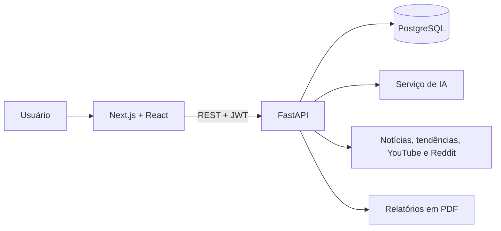

# JIP — Inteligência para Podcasts

O JIP foi uma aplicação Full Stack criada para apoiar a pesquisa, o planejamento e a produção de conteúdo para podcasts. O produto reunia tendências, sugestões de pautas, roteiros, análises de conteúdo e recursos de conformidade em uma única experiência.

O serviço original não está mais ativo. Este repositório preserva o código-fonte como projeto de portfólio e registro técnico, sem credenciais, dados de usuários ou bancos de dados do ambiente original.

## Principais funcionalidades

- autenticação e áreas públicas e privadas;
- pesquisa de tendências e oportunidades de conteúdo;
- geração e organização de pautas, títulos e roteiros;
- histórico de episódios e conteúdos produzidos;
- análise de conformidade e segurança de conteúdo;
- geração de relatórios em PDF;
- integração com APIs externas e serviços de inteligência artificial;
- dashboards e visualização de métricas.

## Tecnologias

### Frontend

- Next.js 15 e React 19;
- TypeScript;
- Tailwind CSS;
- Axios, Zod, Recharts e Framer Motion.

### Backend

- Python e FastAPI;
- SQLAlchemy, Alembic e PostgreSQL;
- autenticação com JWT;
- integrações HTTP assíncronas;
- OpenAI e APIs de tendências, notícias, YouTube e Reddit;
- ReportLab para geração de PDF.

## Estrutura

```text
frontend/  Aplicação web em Next.js
backend/   API, regras de negócio, modelos, serviços e migrações
```

## Arquitetura



O frontend concentra a experiência e os dashboards. A API organiza autenticação, regras de negócio e integrações em routers, services, schemas e models.

## Execução local

O projeto depende de serviços externos que podem não estar mais disponíveis. Para estudo do código, configure apenas as integrações que deseja utilizar.

### Frontend

```bash
cd frontend
npm install
npm run dev
```

### Backend

```bash
cd backend
python -m venv .venv
pip install -r requirements.txt
cp .env.example .env
uvicorn app.main:app --reload
```

Preencha o `.env` localmente. Nunca envie credenciais reais ao Git.

## Segurança e privacidade

Esta recuperação foi criada a partir de uma cópia limpa, sem o histórico dos repositórios originais. Foram excluídos arquivos de ambiente, bancos locais, caches, configurações de editor e dados de execução.

## Qualidade

O GitHub Actions executa instalação limpa e build do frontend a cada push e pull request. A correção integral do typecheck e a inclusão de testes automatizados de regras de negócio permanecem como evoluções planejadas.

## Autoria

Desenvolvido por [Karen Angelis](https://github.com/KarenAngelis).
